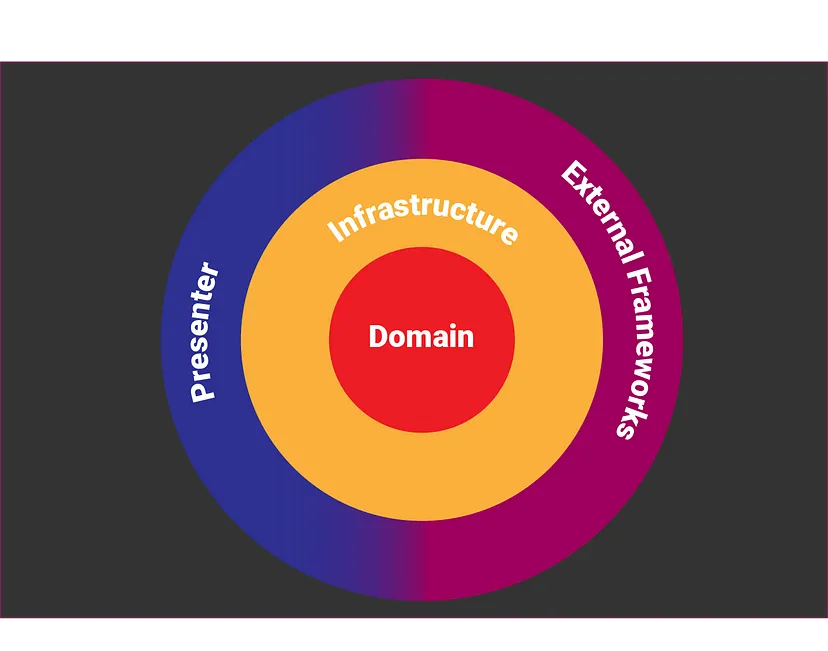

# Dự án quản lý chi tiêu + flutter

## Cấu trúc dự án

Dự án được cấu trúc theo mô hình Clean Architecture (Cấu trúc sạch)

Cấu trúc bao gồm các thành phần sau: 
- <b>Presenter</b> — Our UI components, basically everything that it’s a widget or a widget’s controller.
- <b>Domain</b> — The app’s core. All entities and business logic will be held here.
- <b>Infra</b> — Support the Domain layer by adapting the data coming from the external layer through models, repositories, and services.
- <b>External</b> — Classes to wrap functionalities from third-party libraries, sensors, SO, storage, and any other external dependency of our app.

# money_tracker
